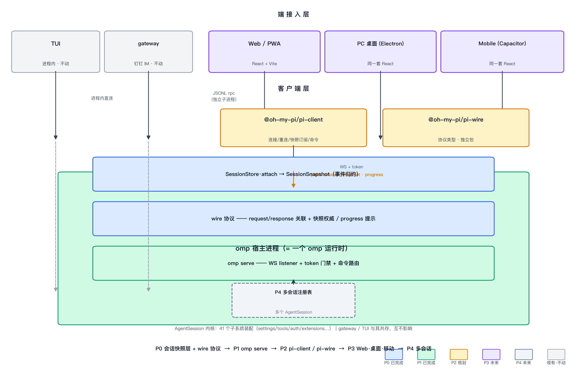

# Multidevice Host — 多端架构方案

> 分支 `multidevice-host` · worktree `../oh-my-pi-multidevice`
> 目标：**一个 cornfield 同时支持 TUI / Web / PC / Mobile**
> 状态：P0/P1 已完成并提交；P2 规划中

## 1. 目标与边界

把 cornfield 从「单会话 CLI 应用」演进为「**agent 宿主（host）+ 多端接入层**」：
同一个 cornfield 进程加载 settings/auth/tools/会话，TUI 照常进程内渲染，
web/pc/mobile 通过网络协议连这个宿主。会话的「权威快照 + 增量事件」
成为单一事实源，所有端消费同一套语义。

**明确的边界（已拍板）**：
- 部署形态：单机 host（127.0.0.1 + token），不做服务器多账号
- 会话粒度：单会话起步，多会话是 P4
- TUI **不迁移**走网络：进程内直连，多端一致性靠同一快照源 + 协议测试保证
- gateway（钉钉 IM）**不动**：每账号一子进程的隔离模型是它的资产，不合并
- 后端协议与前端框架改造放同一分支（未来前端方案在此承接）

## 2. 架构总览



```
                 ┌──────────────────────── cornfield 宿主进程 ─────────────────────────┐
                 │                                                               │
  TUI ──进程内──▶ │  InteractiveMode（不动）                                     │
                 │      │ 订阅 AgentSession                                      │
  gateway ─────▶ │  rpc-mode（不动，JSONL）      SessionStore（P0）               │
  (现有)         │      │                           │ attach                    │
                 │      ▼                           ▼                            │
                 │  AgentSession          SessionSnapshot（权威快照 + 事件归约）  │
                 └──────────────────────────────────┼───────────────────────────┘
                                                    │ wire 协议（JSON 帧）
                                                cornfield serve（P1）
                                                    │ WS + token
                             ┌──────────────────────┼───────────────────────┐
                             ▼                      ▼                       ▼
                          pi-client（P2）        Web（P3）              PC/Mobile（P3）
                        @cornfield/pi-wire      （前端框架）
```

## 3. 分层说明

### 3.1 会话快照层（P0，`src/session/session-store.ts`）
- `SessionSnapshot`：权威字段（sessionId/model/thinkingLevel/messages/todoPhases/
  activeToolNames/队列计数）+ 运行时 phase 枚举（idle/streaming/compacting/
  retrying/executing_tool + retryAttempt），**绝不序列化 handle**
  （AbortController/Promise/Timer 全排除）
- `reducePhase()`：纯函数事件→阶段归约；结束类事件保守归约到 idle
- `SessionStore.attach(session)`：装饰器注册进 `AgentSession.subscribe()`，
  零侵入；getSnapshot() 实时读 session getter（权威源），派生状态（seq/phase/
  retryAttempt）由事件归约
- 一致性语义：进度事件（message_update 等）只触发通知；快照为权威；
  断线重连 = 先全量快照重建再订阅增量

### 3.2 wire 协议（P0，`src/server/wire-types.ts`）
- 传输：WebSocket 文本帧 = 一个 JSON 对象；二进制帧预留 CBOR 后路
- 信封：客户端 `hello{version, token}` → 服务端 `hello_ack{connectionId}`；
  请求 `request{id, command}` → `response{id, ok, result|error}`；
  服务端推送 `push{event: server_snapshot | session_snapshot(权威) | progress(提示)}`
- 命令面：25 条复用 rpc-types（类型级 Extract 筛选），剔除 5 条 gateway 包袱
  （set_steering_mode / set_follow_up_mode / set_interrupt_mode /
  set_disabled_toolsets / export_html）；新增 subscribe/unsubscribe/
  get_snapshot/attach/detach
- 版本：`MULTIDEVICE_PROTOCOL_VERSION = 1`

### 3.3 serve 宿主（P1，`src/commands/serve.ts` + `src/server/wire-server.ts`）
- 装配复用 main.ts 导出序列（export createSessionManager/buildSessionOptions，
  零行为变化）+ createAgentSession
- token 门禁：/ws upgrade 校验 query token；握手校验 hello 版本+token
- 事件 → 广播：每次事件推 session_snapshot（全量）+ progress（仅 delta 型事件）
- SIGINT/SIGTERM 优雅停止；未实现命令显式 not_implemented（不静默）

### 3.4 客户端（P2 规划）
- 抽 `@cornfield/pi-wire` 独立包（纯类型，帧类型/命令面/协议版本）
- `@cornfield/pi-client`：连接状态机 + 请求 id 关联（Promise + 超时）+
  快照缓存 + subscribe（跨重连持续）+ 指数退避重连
- 断线语义：在途请求立即拒绝（PiDisconnectedError），fail fast

## 4. 关键设计决策（含依据）

| 决策 | 选择 | 理由 |
|---|---|---|
| 快照 vs 增量 | 快照权威 + progress 提示 | 重连=重拉快照，UI 零恢复逻辑（上游语义） |
| 消息历史 | getSnapshot 实时读 session.messages | 不重复复制，避免 compaction/rewind 后增量失配 |
| TUI | 不迁移 | 进程内直连 + 测试保证一致性，不为教条付成本 |
| 租约锁 | 不需要 | 本地单进程 AgentSession 写入串行；上游多进程才需租约 |
| gateway 隔离 | 保持子进程模型 | 进程/内存/文件系统/故障域四层隔离是它的资产 |
| 协议格式 | JSON 起步 | 浏览器零依赖、DevTools 可看、与 rpc-types 同构；CBOR 留后路 |
| 命令面 | rpc-types 子集复用 + 剔除包袱 | gateway 生产验证过的命令面，不带 IM 专属语义 |

## 5. 阶段路线图

| 阶段 | 内容 | 状态 | 验证 |
|---|---|---|---|
| P0 | 会话快照层 + wire 协议类型 | ✅ 已提交 `4d475a0f` | 11 单测，biome/tsgo 干净 |
| P1 | `cornfield serve` WS 宿主 | ✅ 已提交 `26c12e1e` | 6/6 真机 e2e（hello/快照/命令/not_implemented/认证 401/404）|
| P1.5 | 手工协议验证 | ✅ 已完成（bun WS 客户端） | 见 P1 e2e |
| P2 | `pi-wire` 抽包 + `pi-client` | 规划中（方案已出） | 单测 + serve e2e（替换手工脚本）|
| P3 | Web 端（先 web 后 mobile）| 未开始 | 浏览器实测 |
| P4 | 多会话（会话注册表 idle/active）| 未开始 | — |

## 6. 已验证证据（P1）

- `bun test packages/coding-agent/test/session-store.test.ts`：11 pass
- biome/tsgo：新文件全干净（基线既有错误除外：moa-extension 等）
- 真实 serve 进程 + WS 客户端 6/6 PASS：hello_ack、初始快照推送、
  get_snapshot/get_state/set_thinking_level、bogus 命令显式 not_implemented
- 认证实测：无/错 token → 401，非 /ws → 404

## 7. 风险与遗留

- **worktree 无 natives 构建产物**：`pi_natives.darwin-arm64.node` 为本地复制
  （不入 git），新 checkout 需 `bun --cwd=packages/natives run build`
- prompt → 事件流推送的真实 LLM 冒烟未做（协议闭环已验证；触发即真实计费）
- wire-types 目前仍在 coding-agent 内（P2 抽包前）；命令面依赖 rpc-types Extract
- 快照 messages 全量传输，长会话几十 KB —— P3 后按需做尾部/分页
- 上游 0.84 CBOR/租约链路不直接依赖（experimental + 架构分叉），仅参考语义

## 8. 启动方式

```bash
# worktree 内
bun --cwd=packages/coding-agent src/cli.ts serve --port 7891
# 输出 ws://127.0.0.1:7891/ws?token=<随机>
```