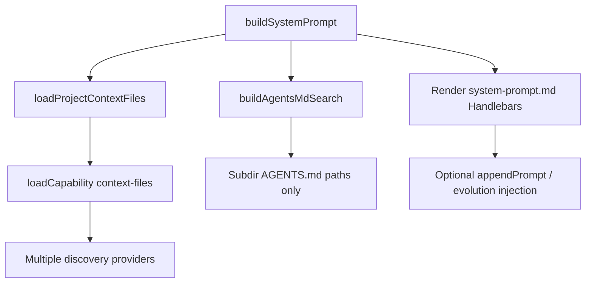

# OMP Prompt Assembly v1.0

**Status**: Design reference (2026-05-26)  
**Scope**: How OMP assembles the main-session system prompt, and how that compares to Hermes Agent and OpenClaw.  
**Primary implementation**: `packages/coding-agent/src/system-prompt.ts`, `packages/coding-agent/src/prompts/system/system-prompt.md`

---

## 1. Purpose

This document captures:

1. The section structure of OMP’s default system prompt template.
2. How `AGENTS.md` and other context files enter the prompt.
3. Deduplication and hard-constraint handling.
4. A structured comparison with **Hermes Agent** and **OpenClaw** prompt assembly.

Use it when customizing OMP toward a personal/team agent (Hermes/OpenClaw style) or when refactoring prompt layers.

---

## 2. OMP assembly pipeline



| Step | Code | Output |
|------|------|--------|
| Discover context | `loadProjectContextFiles()` → `loadCapability("context-files")` | `{ path, content, depth? }[]` |
| Dedupe by content | `dedupeExactContextFiles()` | Keep closest-to-cwd when byte-identical |
| Strip NEVER lines | `prepareContextFilesForPrompt()` | NEVER/MUST NOT → not in `<context>` body |
| Extract hard rules | `extractNeverRules()` | `noYieldRules` → `<hard-constraints>` |
| Subdir index | `buildAgentsMdSearch()` | Paths only → `<dir-context>` |
| Render | `prompt.render(system-prompt.md, data)` | Final system prompt string |

**SDK entry**: `discoverContextFiles(cwd)` in `packages/coding-agent/src/sdk.ts`.

**Custom prompt path**: If `customPrompt` is set, `custom-system-prompt.md` is used instead of the full default template (see `system-prompt.ts`).

---

## 3. `system-prompt.md` section structure

The default template uses six `{{SECTION_SEPARATOR "…"}}` blocks (helper in `@oh-my-pi/pi-utils` `prompt.ts`) plus a preamble and optional hard-constraints block.

```text
┌─────────────────────────────────────────────────────────┐
│ [Preamble] RFC 2119, XML tag semantics, anti-injection   │
│ [Optional] <hard-constraints> (noYieldRules from AGENTS) │
├─────────────────────────────────────────────────────────┤
│ Workspace    Environment facts + project context         │
├─────────────────────────────────────────────────────────┤
│ Identity     Role, contracts, engineering philosophy     │
├─────────────────────────────────────────────────────────┤
│ Environment  Harness URIs, skills, rules, tool guidance  │
├─────────────────────────────────────────────────────────┤
│ Rules        Contract, design integrity, Procedure 1–6   │
├─────────────────────────────────────────────────────────┤
│ Now          cwd, date, critical startup instructions    │
└─────────────────────────────────────────────────────────┘
```

### 3.1 Preamble and hard constraints (lines 1–19)

- Declares `MUST` / `NEVER` per RFC 2119.
- Defines XML tags (`<role>`, `<contract>`, etc.) as structural markers only.
- **`noYieldRules`**: Lines from `AGENTS.md` containing `NEVER` or `MUST NOT` (see `extractNeverRules` in `system-prompt.ts`).
- Rendered as `<hard-constraints>` — not overridable by user style preferences.
- Cross-referenced in `<contract>` (Rules section) so rules are not duplicated in prose.

### 3.2 Section: Workspace

| Block | Condition | Content |
|-------|-----------|---------|
| `<workstation>` | Always | `environment`: OS, GPU, terminal, etc. |
| `<context>` | `contextFiles.length` | Full text of each context file in `<file path="…">` |
| `<dir-context>` | `agentsMdSearch.files` | **Paths only** — agent must `read` before editing those dirs |
| `appendPrompt` | Non-empty | Extra system text (memory, extensions, etc.) |

**Monorepo**: Multiple `AGENTS.md` from walk-up can all appear in `<context>` (different `depth` keys). Subdirectory agents are indexed, not fully injected (depth 1–4 scan, limit 200).

### 3.3 Section: Identity

Static product persona and engineering norms (mostly not Handlebars-dynamic):

| Tag | Topic |
|-----|--------|
| `<role>` | Staff engineer inside Oh My Pi coding harness |
| `<instruction-priority>` | User vs AGENTS hard constraints vs system safety |
| `<failure-mode-policy>` | Missing info → `[inference]` / `[blocked]` |
| `<pre-yield-check>` | Checklist before yielding |
| `<communication>` | No emoji, no recap paragraphs |
| `<output-contract>` | When a turn is “complete” |
| `<default-follow-through>` | Low-risk proactive action |
| `<behavior>` | Anti “compiles = done” |
| `<code-integrity>` | Outside-in, callers / system / time |
| `<stakes>` | High-reliability domain assumptions |
| `<principles>` / `<design-checklist>` | Pre-edit design checks |

**Note**: `identity` tool `whoRu` text can differ from `<role>` here.

### 3.4 Section: Environment

Dynamic blocks gated by `{{#has tools "…"}}`, `{{#ifAny …}}`:

1. Internal URI scheme (`skill://`, `memory://`, `agent://`, `local://PLAN.md`, etc.).
2. Skills list (`{{#each skills}}`).
3. `alwaysApplyRules` full text + rules index (name, globs, description).
4. Tools list (optional per-tool descriptions via `repeatToolDescriptions`).
5. Conditional guides: intent tracing, MCP discovery, python/bash priority, read/write/search/find/edit, LSP, AST, SSH, `eagerTasks`, image inspection, search-before-read, `<tool-persistence>`.

`toolRefs` maps internal tool names to wire names shown to the model.

### 3.5 Section: Rules

1. **`<contract>`** — Non-negotiable yield, testing, honesty, scope rules; `<completeness-contract>` for batches/multi-file work.
2. **`# Design Integrity`** — Markdown (not XML): single representation, types, remove obsolete code, etc.
3. **`# Procedure`** — Six steps: Scope → Before edit → Parallelization → Todos → While working → Verification (tool-gated subsections).

Optional `<redacted-content>` when `secretsEnabled`.

### 3.6 Section: Now

- Current `cwd` and `date`.
- `<critical>`: advance or block; `identity` tool triggers for whoRu / whoisme / update_persona.

### 3.7 Handlebars data contract

Main fields passed from `buildSystemPrompt()` (`system-prompt.ts`):

| Variable | Source |
|----------|--------|
| `noYieldRules` | NEVER/MUST NOT from all loaded `AGENTS.md` |
| `environment` | Machine info |
| `contextFiles` | `loadProjectContextFiles` after strip |
| `agentsMdSearch` | Subdir `AGENTS.md` path list |
| `appendPrompt` | Caller / memory / extensions |
| `skills`, `rules`, `alwaysApplyRules` | Discovery |
| `tools`, `toolInfo`, `toolRefs` | Active tool set |
| `eagerTasks`, `mcpDiscoveryMode`, `intentField`, `secretsEnabled` | Settings / flags |
| `cwd`, `date` | Session |

---

## 4. `AGENTS.md` loading and deduplication

### 4.1 Discovery providers

| Provider | File | Priority (typical) | Behavior |
|----------|------|-------------------|----------|
| `builtin` | `.omp/AGENTS.md` | 100 | Nearest `.omp` config dir |
| `claude` | `.claude/…/AGENTS.md`, `CLAUDE.md` | 80 | Ecosystem compat |
| `agents` | `.agent(s)/AGENTS.md` | 70 | Walk-up + user home |
| `agents-md` | Standalone `AGENTS.md` | 10 | Walk from `cwd` to `repoRoot` / `home` |
| `codex`, `gemini`, `opencode`, `github`, … | Various | Varies | Per-provider |

Registration: `packages/coding-agent/src/discovery/index.ts` (imports all providers).

### 4.2 Capability dedup (same scope, one winner)

```typescript
// context-file.ts
key: file => (file.level === "user" ? "user" : `project:${Math.max(0, file.depth ?? 0)}`)
```

- **user**: one global user-level file.
- **project:N**: one file per depth; **higher-priority provider wins** at the same depth.

### 4.3 Content dedup (byte-identical)

`dedupeExactContextFiles()` keeps the **last** entry in the sorted list for identical `content` — after sort by depth descending, that is the copy **closest to cwd**.

### 4.4 NEVER / MUST NOT handling

| Step | Effect |
|------|--------|
| `extractNeverRules` | All matching lines → `noYieldRules` |
| `stripNeverRuleLinesFromAgentsMd` | Remove those lines from `<context>` body |
| Empty after strip | Omit `<file>` for that path entirely |

**Gap**: Duplicate NEVER lines from multiple `AGENTS.md` files are not deduplicated in `neverRules` (only single-file tests assert count === 1).

### 4.5 Sub-agents (`task` tool)

`packages/coding-agent/src/task/index.ts` filters out context files whose basename is `agents.md` when spawning subagents. Subagents use `subagent-system-prompt.md` + per-agent prompts under `prompts/agents/`.

---

## 5. Three-way comparison: OMP vs Hermes vs OpenClaw

### 5.1 Structural model

| Dimension | OMP | Hermes | OpenClaw |
|-----------|-----|--------|----------|
| **Organization** | 6 `SECTION_SEPARATOR` + XML tags | 10-layer cached prefix order | Fixed framework sections + `# Project Context` bootstrap |
| **Identity** | Template `<role>` | `~/.hermes/SOUL.md` or default | `SOUL.md` + `IDENTITY.md` |
| **Project rules** | `<context>` multi-file | **One** project context type (priority pick) | Multiple bootstrap files (AGENTS, TOOLS, …) |
| **User profile** | `write_memory(user)` / identity | Frozen `USER.md` snapshot | `USER.md` bootstrap |
| **Long-term memory** | learnings + episodes (injection outside template) | Frozen `MEMORY.md` | `MEMORY.md` + `memory/*.md` on demand |
| **Sub-agent** | Filter `agents.md`; subagent template | `skip_context_files` + default identity | `promptMode=minimal`; AGENTS + TOOLS only |
| **Cache strategy** | Rebuild each `buildSystemPrompt` | Freeze MEMORY/USER for session (prefix cache) | Stable prefix above, volatile channel/runtime below |

### 5.2 Layer map (conceptual)

```text
OMP                          Hermes (cached)              OpenClaw (full mode)
────────────────────────────────────────────────────────────────────────────
[hard-constraints]           (in identity / tools)        Safety
  ↑ AGENTS NEVER                                              Execution Bias
                                                              Tooling
Workspace                    1. SOUL / DEFAULT_IDENTITY     Workspace
  workstation                2. Tool behavior              Documentation
  <context>                    3. Honcho (opt)               ─── cache boundary ───
  <dir-context>                4. Optional system msg        Project Context:
  appendPrompt                 5. MEMORY snapshot              SOUL, IDENTITY, AGENTS,
                               6. USER snapshot                USER, TOOLS, MEMORY…
Identity                       7. Skills index               Messaging, Runtime, …
  role, contract…              8. Project Context (one type)
                               9. Timestamp
Environment                    10. Platform hint             Skills (index)
  tools, skills…
Rules                                                       (in framework + AGENTS)
Now
```

### 5.3 Hermes cached prompt order

Source: [Hermes prompt-assembly.md](https://github.com/NousResearch/hermes-agent/blob/main/website/docs/developer-guide/prompt-assembly.md)

1. Agent identity — `SOUL.md` or `DEFAULT_AGENT_IDENTITY`
2. Tool-aware behavior guidance
3. Honcho block (optional)
4. Optional system message
5. Frozen **MEMORY** snapshot (`§` delimiters, ~2200 char cap)
6. Frozen **USER** snapshot (~1375 char cap)
7. Skills index (`skill_view` on demand)
8. Project context — **first match only**: `.hermes.md` → `AGENTS.md` (cwd) → `CLAUDE.md` → cursor rules
9. Timestamp / session ID
10. Platform hint

**Hermes memory semantics**: Mid-session `memory` tool writes persist to disk but **do not** change the cached system prompt until a new session (prefix cache stability). Tool responses show live state.

### 5.4 OpenClaw framework + bootstrap

Source: [OpenClaw system prompt](https://docs.openclaw.ai/concepts/system-prompt)

**Framework sections (code-generated)**: Tooling, Execution Bias, Safety, Skills, OpenClaw Control/Self-Update, Workspace, Documentation, Sandbox, Date & Time, Output Directives, Heartbeats, Runtime, Reasoning, …

**Bootstrap files** (injected under Project Context):

| File | Role | OMP analogue |
|------|------|----------------|
| `SOUL.md` | Values, tone, boundaries | `<role>` + Identity section (in template) |
| `IDENTITY.md` | Name, emoji, avatar | No dedicated file |
| `AGENTS.md` | Operations, safety, workflows | `<context>` + hard-constraints |
| `USER.md` | User preferences | evolution / identity |
| `TOOLS.md` | Env-specific tool notes | Tool schema + Environment section |
| `MEMORY.md` | Curated long-term memory | learnings / projections |
| `HEARTBEAT.md` | Proactive / scheduled behavior | `omp schedule` + daemon |
| `memory/*.md` | Daily logs, on-demand search | episodes / optional wiki |

**Limits**: `bootstrapMaxChars` per file (default 12000), `bootstrapTotalMaxChars` (default 60000). Sub-agents: only `AGENTS.md` + `TOOLS.md` when `promptMode=minimal`.

### 5.5 Concept placement matrix

| Concept | OMP | Hermes | OpenClaw |
|---------|-----|--------|----------|
| Absolute prohibitions | `<hard-constraints>` + `<contract>` | SOUL + project file + tool layer | Safety + AGENTS |
| Project conventions | `<context>` (multi) | Single project context | AGENTS + TOOLS + … |
| Subdir-specific rules | `<dir-context>` paths | `subdirectory_hints` during session | read + AGENTS prose |
| Skills | List + `skill://` | Index + `skill_view` | Index + `read` SKILL.md |
| Tool discipline | Environment `#has tools` | Layer 2 | Tooling + Execution Bias |
| Completion / yield | pre-yield-check, Procedure §6 | Distributed | Execution Bias |
| Time / machine | workstation + Now | timestamp + platform | Runtime; clock via `session_status` |

### 5.6 Design philosophy

| Product | Emphasis | Best fit |
|---------|----------|----------|
| **OMP** | Full coding harness contract in-repo template; monorepo AGENTS; tool-gated Environment | Strict coding agent, yield/completeness, deep repo rules |
| **Hermes** | SOUL + small frozen MEMORY/USER; single project context file; cache-friendly | CLI agent, cross-session persona, compact memory |
| **OpenClaw** | Workspace markdown split (soul vs handbook vs user vs tools); gateway/channels; heartbeats | IM-connected personal/team agent, multi-workspace |

---

## 6. Alignment with OMP Evolution (V4)

Evolution injects separately in `before_agent_start` (not part of `system-prompt.md` template):

| Layer | Mechanism | Hermes analogue | OpenClaw analogue |
|-------|-----------|-----------------|-------------------|
| Short-term injection | learnings, skills, episodes | MEMORY/USER frozen blocks | MEMORY.md bootstrap |
| Write path | `write_memory` tool | `memory` tool | memory tools + file edits |
| Budget | ~2000 chars injection block | MEMORY 2200 + USER 1375 caps | bootstrap totals |

See `docs/omp-evolution-architecture-v3.md` for the full evolution pipeline.

---

## 7. Migration notes (toward Hermes / OpenClaw style)

| Goal | Suggested approach in OMP |
|------|---------------------------|
| Hermes-like identity | Add `~/.omp/SOUL.md` (or project file) loaded before `<role>`; shorten static `<role>` |
| Hermes-like frozen memory | Optional session-frozen projection of learnings → append block; or document “restart session to refresh” |
| OpenClaw-like workspace | Split: `SOUL.md` / `AGENTS.md` / `USER.md` / `TOOLS.md` under workspace; extend context-file providers |
| Keep OMP strengths | Retain `hard-constraints`, Procedure, `dir-context`, tool gating in Environment |
| Sub-agent parity | Already filters `agents.md`; align with OpenClaw minimal = AGENTS + TOOLS only |

---

## 8. Related files

| Topic | Path |
|-------|------|
| Default system template | `packages/coding-agent/src/prompts/system/system-prompt.md` |
| Custom template | `packages/coding-agent/src/prompts/system/custom-system-prompt.md` |
| Builder | `packages/coding-agent/src/system-prompt.ts` |
| Standalone AGENTS walk-up | `packages/coding-agent/src/discovery/agents-md.ts` |
| `.omp` AGENTS | `packages/coding-agent/src/discovery/builtin.ts` |
| Context capability | `packages/coding-agent/src/capability/context-file.ts` |
| Subagent template | `packages/coding-agent/src/prompts/system/subagent-system-prompt.md` |
| Tests | `packages/coding-agent/test/system-prompt-templates.test.ts` |
| Task agent discovery | `docs/task-agent-discovery.md` |
| Evolution injection | `docs/omp-evolution-architecture-v3.md` |

---

## 9. External references

- Hermes: [Prompt Assembly](https://github.com/NousResearch/hermes-agent/blob/main/website/docs/developer-guide/prompt-assembly.md), [Persistent Memory](https://hermes-agent.nousresearch.com/docs/user-guide/features/memory)
- OpenClaw: [System prompt](https://docs.openclaw.ai/concepts/system-prompt), [Agent workspace](https://docs.openclaw.ai/concepts/agent-workspace)
- Karpathy LLM Wiki (knowledge base pattern, orthogonal to prompt assembly): [llm-wiki.md gist](https://gist.githubusercontent.com/karpathy/442a6bf555914893e9891c11519de94f/raw/ac46de1ad27f92b28ac95459c782c07f6b8c964a/llm-wiki.md)

---

## 10. Changelog

| Version | Date | Notes |
|---------|------|-------|
| v1.0 | 2026-05-26 | Initial doc: OMP `system-prompt.md` structure, AGENTS dedup, Hermes/OpenClaw comparison |
