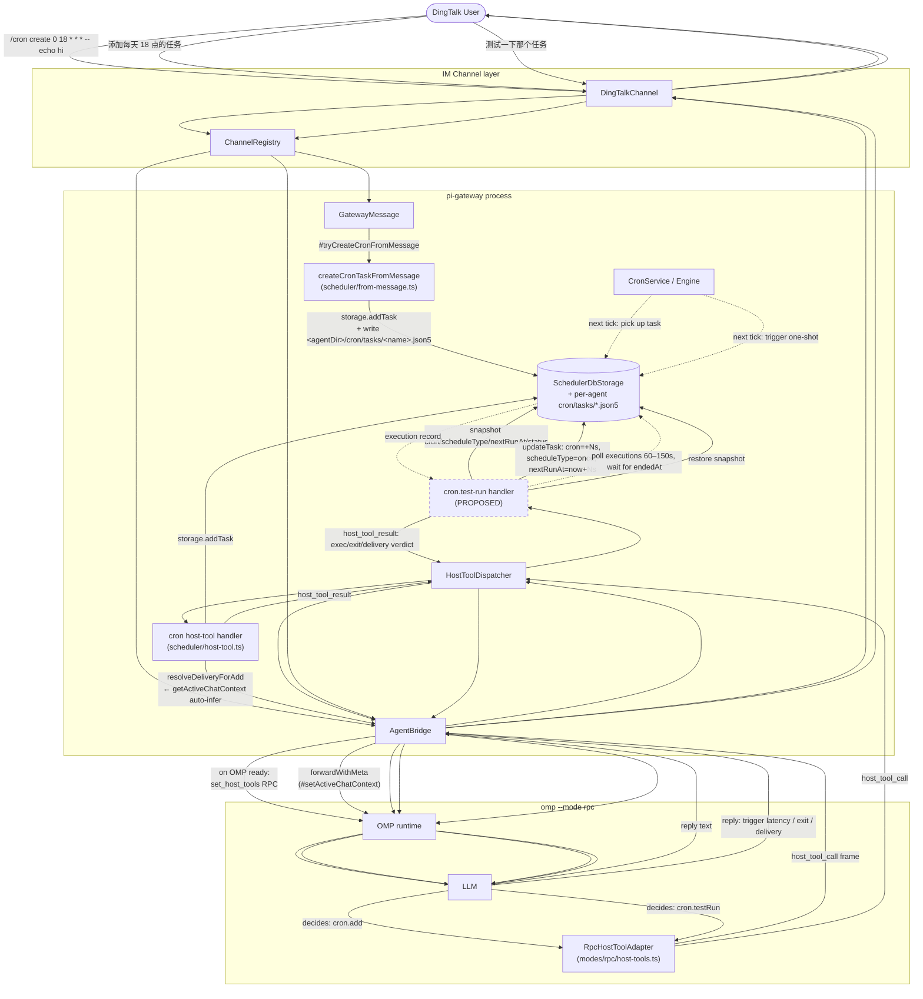

# pi-gateway Cron 模块与 Host-Tool 机制

> 状态：Tier 1 两项均已 ship（2026-06-30）——`cron.test-run`（commit ca8c50d8c） + `bridge.status`（commit 计划在本次设计走完后）。Q2-Q5 后续 design walk-through 仍待跟进。

## 0. 导读

### 0.1 一句话总览

**OMP 是个完全通用的 agent runner，对 DingTalk / cron / gateway 一无所知；gateway 是 host，OMP 是 subprocess，双方通过一套 RPC 帧协议通信。** Gateway 专属的能力（cron、IM channel、agentDir 路由）都必须"注入"到 OMP 里——这就是 host-tool 机制的全部由来。

### 0.2 角色分工

| 角色 | 知道什么 |
|---|---|
| OMP subprocess | 通用 LLM 循环 + 工具调用 + 工具定义。**不知道**有 cron / DingTalk |
| Gateway (host) | DingTalk 协议、agentDir、channel registry、scheduler、SQLite 存储 |
| LLM（在 OMP 里） | 看到"工具列表"，调用就是 |

### 0.3 三条 RPC 协议

```
OMP 启动 → 立刻发 `ready` 给 gateway
     │
     ▼
Gateway 收到 ready ──► 调 set_host_tools RPC
   payload: { tools: [{name:"cron", description:"...", parameters:{...}}, ...] }
     │
     ▼ (OMP 把每个定义包装成 AgentTool 适配器，注册到自己的工具集)
     │
LLM 在 tool_use 里调 cron.add({...})
     │
     ▼ (OMP 内部 AgentTool 适配器拦截)
OMP 写出 frame 到 stdout:
   { type:"host_tool_call", id:"abc123", toolCallId:"...", toolName:"cron", arguments:{...} }
     │
     ▼ (gateway 的 transport 解析 frame，丢给 HostToolDispatcher)
HostToolDispatcher.handleCall()
     │ 查 #handlers map 找到 cron 的 handler
     │ 调 handler.handle(args) ── 真正执行 addTask、读 SQLite、写 JSON5
     ▼
Gateway 通过 transport 写 frame:
   { type:"host_tool_result", id:"abc123", result:{type:"tool_result", content:[...] } }
     │
     ▼ (OMP 的 RpcHostToolBridge.handleResult 找到 pending call 的 promise)
OMP 把 result resolve 给 LLM，LLM 看到 tool_result，继续推理
```

### 0.4 关键文件（按请求流向）

1. **注册工具定义**：`packages/pi-gateway/src/scheduler/host-tool.ts:createCronToolDefinitions()` 返回 `HostToolHandler[]`（definition + handle）
2. **塞给 dispatcher**：`packages/pi-gateway/src/gateway.ts:#buildHostToolDispatcher` 在 gateway 启动时一次性 `dispatcher.setTools([...cron...])`
3. **推到 OMP**：`packages/pi-gateway/src/agent-bridge.ts:187` —— 监听 OMP 的 `ready` 事件，每次都重发 `set_host_tools`（OMP 重启后无记忆，必须重发）
4. **OMP 侧包装**：`packages/coding-agent/src/modes/rpc/host-tools.ts:RpcHostToolAdapter` 把定义包成 `AgentTool`，LLM 看到的就是普通工具
5. **LLM 真调**：`RpcHostToolAdapter.execute()` → `RpcHostToolBridge.requestExecution()` → 写 `host_tool_call` frame → 等 `host_tool_result` frame
6. **gateway 派发**：`host-tool-dispatcher.ts:HostToolDispatcher.handleCall()` 按 name 查 handler，调 `handle(args)`
7. **cron 真干活**：`host-tool.ts:handleCronAction` 按 action 路由到 `handleAdd` / `handleUpdate` / ... → 读写 `SchedulerDbStorage`（SQLite）
8. **回包**：`RpcHostToolBridge.handleResult()` 找到 pending promise，resolve 给 LLM

### 0.5 为什么 cron 必须在 gateway 侧（不能在 OMP 里）

- **调度循环**：cron 触发是 gateway 的 scheduler（setInterval）的事，OMP 没时钟概念
- **触发 agent**：cron 触发 `taskType:"agent"` 任务时，gateway 要**起一个全新的 OMP 子进程**（同一个 agentDir 复用）跑那条 prompt —— OMP 自己没法 fork 自己
- **DingTalk delivery**：channel registry 在 gateway，发送结果要回 IM —— OMP 没 IM 概念
- **account 隔离**：每个 accountId = 一个 OMP 子进程；cron 任务横跨 account，调度必须在 OMP 之外的 gateway

### 0.6 为什么 LLM 不能用 `bash` 调 `omp gateway cron ...` 代替

- **D4 auto-inference 拿不到**：`resolveDeliveryForAdd()` 读 `bridge.getActiveChatContext()` 自动填 `channel/accountId/toUserId`，CLI 没这个上下文，LLM 只能硬编 `dingtalk:user:<staffId>` —— staffId 是平台内部 ID，LLM 不该知道
- **Round-trip 浪费**：shell out 起一个独立 OMP 进程跑 CLI 拿结果，再把 stdout parse 回 LLM，绕了一圈
- **状态不一致**：CLI 的写路径和 host tool 的写路径**共享同一个 SQLite**（`SchedulerDbStorage`），所以技术上一致；但 LLM 串行 prompt 上下文里把 "schedule = 0 18 * * *" 解析错，host tool 会通过 `parseSchedule` 立刻报错返回 `isError:true`，CLI 要靠 exit code 和 stdout 文本 parse
- **Tool 描述即文档**：cron 工具的 `description` 里写满了 MUST / MUST NOT 规则，LLM 在 system prompt + tool description 双重提示下走对路径；shell + CLI 路径没有任何 in-band 校验

### 0.7 简而言之

- `host-tool` = gateway 把自家能力**声明**给通用 OMP，让 OMP 上的 LLM 当作原生工具调
- `set_host_tools` = 声明的 wire 格式
- `host_tool_call` / `host_tool_result` = 调用的往返帧
- `cron` = gateway 声明的第一个 host tool
- LLM 看不到"RPC 协议"，看到的只是工具描述和 `tool_use` 块

## 1. 概述

pi-gateway 通过两条路径接收 cron 任务创建：

| 路径 | 入口 | 是否经 LLM | delivery 来源 | 持久化 |
|---|---|---|---|---|
| Slash 命令 | 硬编码 `/cron create …` 前缀 | 否 | 不填 | JSON5 文件 + SQLite |
| LLM Host-Tool | 用户自然语言 | 是 | auto-infer 自 `getActiveChatContext()` | 仅 SQLite |

Host-Tool 机制把 gateway 端的本地实现（cron storage、channel registry、活跃聊天上下文）通过 OMP RPC 协议暴露给 LLM，使 LLM 能在 IM 聊天中完成"创建/查询/修改定时任务"等操作。

本文档是 `test-run` 等更多 host-tool 能力的设计起点。Tier 1 两项已 ship（2026-06-30）：`test-run`（`cron` tool 的 `action: "test-run"`，CLI + LLM 共享 `test-run.ts:runTestRun` core）+ `bridge.status`（独立 host tool，返回 AgentBridge snapshot + 派生的 `summary`）。后续 Q2-Q5（return shape / blocking model / cancel / concurrency）仍在本设计文档的待决列表里。

## 2. 现状机制

### 2.1 Slash 命令路径（不经 LLM）

**入口**：`packages/pi-gateway/src/gateway-message.ts` `#tryCreateCronFromMessage`
- 在 `handleInboundMessage` 中作为 fast-path 早于 LLM 路径执行
- 文本必须以 `/cron create` 起头
- 文本不匹配 → 返回 `undefined`，fall-through 到 LLM 路径

**解析**：`packages/pi-gateway/src/scheduler/from-message.ts` `parseCronIntent`
- 格式：`/cron create <schedule> -- <command...>`
- 用 `--` 作为 schedule / command 分隔符（避免与 cron 表达式自身的空格冲突）

**持久化**：`createCronTaskFromMessage` 双写
1. `<agentDir>/cron/tasks/<name>.json5`（人类可读 / git 友好）
2. `SchedulerDbStorage.addTask`（运行时真相）
- DB 写入失败时回滚 JSON5 文件，避免孤儿定义

**限制**：
- 硬编码 `type: "shell"`，不支持 `type: "agent"`
- 不做 LLM 解释/校验
- 不带 delivery（任务进 DB 时 delivery 字段缺失）
- 不带 model / skills / toolsets / preScript

### 2.2 LLM Host-Tool 路径

**工具定义**：`packages/pi-gateway/src/scheduler/host-tool.ts` `createCronToolDefinitions`
- actions：`add | list | show | update | remove | enable | disable | run | runs`
- 参数 schema 通过 `@sinclair/typebox` 严格约束
- `add` 操作的 description 强制要求 LLM **省略** `delivery` 字段，由 gateway 端 auto-infer（见 §2.4）
- `add` 端在 `SchedulerDbStorage.addTask` 写入时 stamp 2 个 audit 字段：
  - `createdByUserId = bridge.getActiveChatContext()?.userId`（可选；无 chat context 时为 `undefined`）
  - `createdByAccountId = ctx.accountId`（永远有；OMP 进程绑定的 accountId）
- `createdBy*` 是 **audit 字段**，不参与访问控制。**scope = agent**：同一 OMP 进程里的所有用户共享同一个 task list（`StorageDbStorage` 已经是 per-account / per-agent）。`list` / `show` / `update` / `remove` / `runs` 不过滤。LLM 想答"哪些是我创建的"可以调 `list` 后在 result 上 client-side filter `createdByUserId === <current userId>`。
- 详见 §6.5 跟 openclaw 的对照。

**`run` action 当前是占位符**：
```ts
case "run":
  return errResult("'run' via LLM is not yet supported; use `omp gateway cron run <name>` from the CLI");
```

### 2.3 Host-Tool 注册与分发

**Dispatch 端**：`packages/pi-gateway/src/host-tool-dispatcher.ts` `HostToolDispatcher`
- `name → handler` 字典 + outbound frame writer
- 构造时机：`Gateway.#buildHostToolDispatcher` — 在 `AgentBridge` 构造前完成 tool 注册
- 当前仅一个 host tool：`cron`（`setTools([cron])`）

**注册生命周期**：`AgentBridge.#registerHostTools` 在每次 OMP `ready` 事件触发时执行：
```ts
case "ready":
  this.#crash.setReady(true);
  this.#registerHostTools();  // 崩溃后必须重发
```
- 协议：`set_host_tools` RPC 命令（`packages/coding-agent/src/modes/rpc/rpc-mode.ts` line 595）
- OMP 侧：`hostToolBridge.setTools(definitions)` → `RpcHostToolAdapter`（`packages/coding-agent/src/modes/rpc/host-tools.ts` line 87）
- 幂等保证：dispatcher 持有 definitions 缓存，gateway 重启后 dispatcher 重建时一次性写入

**调用流程**：
1. LLM 决定调用 `cron.add`
2. OMP 通过 `host_tool_call` 帧回传（无 id，由 transport 处理）
3. `RpcTransport.hostToolHandler` callback → `HostToolDispatcher.handleCall`
4. Dispatcher 路由到 handler → 写 `host_tool_result` 帧回 OMP
5. OMP 注入 tool_result 给 LLM，LLM 继续生成自然语言回复

**关键属性**：
- Handler 在 pi-gateway 进程内本地运行，可访问：
  - `SchedulerDbStorage`（SQLite + 文件 store）
  - `ChannelRegistry`（channel 路由）
  - `AgentBridge.getActiveChatContext()`（D4 auto-infer，见 §2.4）
- 与 LLM 进程隔离：handler 失败不影响 OMP 子进程

### 2.4 Delivery Auto-Inference (D4)

`cron.add` handler 在 LLM 省略 `delivery` 时读取活跃聊天上下文并自动填充。

**上下文写入窗口**：`AgentBridge.forwardWithMeta`
- 入口：`#setActiveChatContext(msg)`
- finally：`#clearActiveChatContext()`
- 存活范围 = 单次 LLM 调用的整段执行

**推断规则**（`scheduler/host-tool.ts` `resolveDeliveryForAdd`）：
- DM：`{channel: msg.channelId, accountId: msg.accountId, toUserId: msg.userId}`
- 群：`{channel: msg.channelId, accountId: msg.accountId, toConversationId: msg.conversationId}`
- 推断失败（无活跃上下文 / channel 未注册） → 显式 error 让 LLM 重新发起带 delivery 的调用

**外部 chat 上下文缺失场景**：cron 触发自身再调用 LLM（嵌套）时，`getActiveChatContext()` 返回 `undefined`，handler 必须拒绝 auto-infer 并要求显式 delivery。

## 3. 架构图



## 4. 端到端时序：用户发送消息"每天 18:00 把今天的工作内容总结给我"

```mermaid
sequenceDiagram
    autonumber
    actor U as User (DingTalk)
    participant CLI as omp CLI
    participant GW as Gateway
    participant CL as CronLifecycle
    participant CH as DingTalkChannel
    participant CR as ChannelRegistry
    participant AB as AgentBridge (per account)
    participant HTD as HostToolDispatcher
    participant RT as OMP subprocess (--mode rpc)
    participant AD as RpcHostToolAdapter
    participant LLM as LLM
    participant ST as Storage (SQLite + file store)

    rect rgb(230,245,255)
    Note over CLI,ST: Phase A — 启动 (gateway.json → ready)
    CLI->>GW: loadConfig() 读 ~/.omp/gateway.json
    GW->>GW: start() — PID 校验, init session store
    GW->>CL: new CronLifecycle().start()
    CL->>ST: 打开 SchedulerDbStorage; file-store syncToDb
    CL->>CL: CronService + SchedulerEngine.start(); 60s tick
    GW->>CR: 注册 channels (按 channels.dingtalk.accounts)
    CR->>CH: 每 account 一个 DingTalkChannel.connect()
    CH->>CH: DWClient WebSocket on('message')
    CR->>AB: 每 account 一个 AgentBridge.start()
    Note over AB: 构造 HostToolDispatcher, 注入 cron handler
    AB->>HTD: setTools([cron])
    AB->>RT: spawn `omp --mode rpc`
    RT-->>AB: 发出 ready 事件 (stdout frame)
    AB->>RT: set_host_tools RPC (definitions)
    RT->>AD: setTools(definitions) → 包成 AgentTool
    Note over AB,RT: 后续 OMP 崩溃重启会再次 ready, set_host_tools 必须重发
    CR->>CR: connectAll(inboundHandler) — DingTalk 入站就绪
    end

    rect rgb(255,250,230)
    Note over U,ST: Phase B — 用户消息
    U->>CH: "每天 18:00 把今天的工作内容总结给我"
    CH->>CH: #setupMessageListener 解析 raw → InboundMessage
    CH->>CR: onMessage 回调路由
    CR->>GW: MessageHandler.handleInboundMessage(msg)
    GW->>GW: 检查 abort / model-command / new-session — 全不命中
    GW->>ST: store.getSession / createSession (per agentDir)
    Note over GW: 文本不以 /cron create 开头 — 跳过硬路径
    GW->>CR: registry.get(`${channel}:${account}`)
    GW->>CH: streamCard(msg, session, ctx, submit)
    CH->>AB: submit(handlers) → enqueueWithMeta → forwardWithMeta
    AB->>AB: #setActiveChatContext(msg) ← D4 推断关键
    AB->>RT: send user_prompt frame
    RT->>LLM: 流式推 messages
    LLM->>AD: tool_use: cron.add
    AD-->>AB: host_tool_call frame
    AB->>HTD: handleCall(call)
    HTD->>AB: getActiveChatContext() — DM
    Note over HTD: auto-infer delivery = {channel, accountId, toUserId}
    HTD->>ST: parseSchedule("0 18 * * *") + addTask
    ST-->>HTD: task row
    HTD-->>AB: host_tool_result
    AB-->>RT: 写 result frame
    RT->>LLM: tool_result 注入上下文
    LLM-->>RT: 生成自然语言回复
    RT-->>AB: text delta 事件
    AB-->>CH: 流入 AI Card 流式渲染
    RT-->>AB: agent_end
    AB->>AB: #clearActiveChatContext()
    CH-->>U: 卡片最终化
    end

    rect rgb(245,255,245)
    Note over ST,U: Phase C — 18:00 真正触发 (test-run 正是要测这一段)
    ST->>CL: SchedulerEngine tick 命中 nextRunAt
    CL->>AB: CronService.onTrigger → executeCronAgent
    AB->>RT: bridge.executePrompt (cron session)
    RT-->>AB: 总结文本
    CL->>CR: deliver(text) → registry.sendMessage
    CR->>U: 推回用户 DM
    end
```

### 时序关键点

1. **`set_host_tools` 在 OMP `ready` 之后才发**。从 OMP spawn 到 host tool 真正可用有几百毫秒到 1-2 秒的窗口。生产几乎无感，但存在理论竞态。
2. **D4 auto-infer 依赖 `#setActiveChatContext` 的写入窗口**。该字段在 `forwardWithMeta` 入口写、finally 块清。abort / OMP crash 会导致 handler 拿到 `undefined` → 当前实现返回 error。
3. **slash 路径与 LLM 路径在 `handleInboundMessage` 内互斥**。`#tryCreateCronFromMessage` 命中则 `return`；不命中才走 LLM。两条路径互不污染。
4. **host tool 的 storage 调用是这次消息唯一的副作用**。task row 写完后，18:00 的真正执行（Phase C）由 `SchedulerEngine` 在另一个时间线驱动。
5. **`set_host_tools` 在每次 OMP `ready` 都要重发**。崩溃恢复路径靠这个幂等重发工作。

## 5. 提议：把 `test-run` 暴露为 host tool

### 5.1 背景

`cronTestRun` 在 `packages/pi-gateway/src/scheduler/cli-commands.ts` line 698 已经完整实现：

- 快照 task 的 `cron` / `scheduleType` / `nextRunAt` / `status`
- 改写为 `+Ns` 一次触发
- 轮询 executions 表（默认 2s 间隔，最多 150s），等 `endedAt` 落地
- 还原快照（除非 `--no-restore`）
- 报回 trigger latency / exit / delivery 状态

CLI 分发器已经接入（`packages/coding-agent/src/commands/gateway.ts` line 583 `case "test-run"`），但 IM 聊天用户用不到 — 终端工具。

把 `test-run` 暴露为 LLM host tool 可以让用户用自然语言触发，例如：

> "测试一下刚才那个 18:00 的任务"

LLM 自动调 `cron.testRun(name)`，handler 走真实调度路径，验证 warm bridge → agent → DingTalk 整条管线。

### 5.2 待决问题：Q1 — 暴露形态

| 方案 | 描述 | 优势 | 劣势 |
|---|---|---|---|
| **A. 扩展现有 `cron` tool** | 新增 `action: "test-run"` 替换或并存 `run` 占位 | 工具面单一；auto-infer / schema 复用；LLM 切换成本低 | handler 阻塞 60-150s，期间 LLM turn 持有 |
| **B. 独立 host tool** | 注册 `cron_test_run`（或 `cron.test`） | schema 独立（`name`, `--in`, `--timeout`, `--no-restore` 显式）；长阻塞工具可单独配 timeout | 工具面多一个；LLM 需学习与 `cron.run` 的区别 |

**初步推荐：A**。`test-run` 语义上是 `cron` 域内的操作（"测试一个已存在的 cron 任务"），独立 tool 会割裂概念；阻塞时间虽然长，但可以通过让 handler 立刻返回 + scheduler 通过正常 channel delivery 回推结果来缓解（具体策略见后续 design walk-through）。

> Q1 定案为 A，于 2026-06-30 ship（commit ca8c50d8c）。详见 §7.2。同时 `bridge.status`（Tier 1 另一项）于同日 ship。

### 5.3 后续 design walk-through 待办

Q1 已定案（2026-06-30）。`bridge.status` 也在同日 ship。Q2-Q5 还未做：

- Q2：返回内容形态（`host_tool_result` 是结构化 JSON 还是自然语言？LLM 如何根据 verdict 生成回复？）
  - 初步走向：结构化 JSON（当前已 ship）。LLM 根据 `result.kind` 决定语气。后续可考虑 verdict→自然语言的 adapter 层。
- Q3：阻塞模型（handler 持 LLM turn 60-150s / 立即返回 + scheduler 推回 / 中间状态回流）
  - 拍板：handler 持 turn（同步），最长 ~120s。LLM 取消时 OMP 丢结果帧，gateway 仍跑完（详见 §7.2）。
- Q4：取消语义（LLM / 用户中途取消 `test-run` 时如何中断 in-flight 轮询 + 还原快照）
  - 拍板：schedule 永远还原（finally 不变量）。abort 路径返回 `kind: "aborted"`。后续 wire cancel 帧到 `HostToolDispatcher.handle` 是 cleanup 工作。
- Q5：并发（同 session 多任务测试 / 同账号多 session 并发 test-run）
  - 现状：未加锁。理论上同一 task 两次并发 test-run 会互相覆盖 schedule rewrite；需要时加 advisory lock。

### 5.4 scope 决策（2026-06-30）

Q1 之前先决的 scope 问题，结论：

- **scope = agent**（= OMP 进程 = `SchedulerDbStorage` 所在的 SQLite），不是 user，也不是 conversation
- `createdByUserId` / `createdByAccountId` 是 audit 字段，**不**控制可见性
- `list` / `show` / `update` / `remove` / `runs` 不过滤：同一 agent 内的任何 user、任何 conversation 调都能看到/管理该 agent 的全部 task
- 之前讨论中的 `scope` LLM 参数、跨 scope 写、admin `--all-users` flag、legacy task migration — **全部不实现**

LLM 的 `cron` 工具 description 已写明这一点：「`My` in a cron context refers to the current agent, not the user asking. All users in the same agent see the same task list」。

## 6. Doc-drift 修复记录

### 6.1 修复内容

2026-06-30 收口 `SYSTEM.md` 与 `TOOLS.md` 在 cron 用法上的 doc-drift。

**drift 现象**：
- `hr3/TOOLS.md` 写 "MUST use the `cron` host tool... Do NOT run `omp gateway cron create`"
- `hr3/.omp/SYSTEM.md` 同时教 LLM 跑 `omp gateway cron create '<cron>' '<command>' --type agent --account hr ...`
- 两个 always-on 文件在同一 agent 上互斥，LLM 同时加载时不知道听谁
- 同样的 v1 schema（`--deliver dingtalk:user:<userId>`）出现在 4 个 workspace 的 `SYSTEM.md`，与 `host-tool.ts` 明确禁止的 v1 标志冲突
- `omp-atomix` / `omp-me` / `omp-sw` 的 `TOOLS.md` 完全没有 cron 章节（缺漏而非矛盾）

**修复**：
- 所有 workspace 的 `SYSTEM.md` "定时任务（cron）" 段替换为指向 `TOOLS.md` 的指针，加 MUST NOT 通过 `bash` 调起 CLI 的硬约束
- 所有 gateway workspace 的 `TOOLS.md` 添加规范的 `cron (gateway host tool)` 章节
- Skeleton `packages/coding-agent/src/skeleton/assets/TOOLS.md` 同样添加该章节（占位符版本），新 agentDir 默认获得

### 6.2 现在的契约

| 角色 | 路径 |
|---|---|
| LLM 在 IM 聊天中创建/查询/管理任务 | `cron` host tool（MUST NOT bash + CLI） |
| Operator 在终端、CI、灾难恢复 | `omp gateway cron ...` CLI（不在 LLM 文档中出现） |

`SYSTEM.md` 负责 "gateway 工作方式 / 当前配置 / 工具纪律 / 完成纪律 / IM 沟通纪律" 等运行时元数据；`TOOLS.md` 负责 "工具用法 + co-located MUST/MUST NOT"。Cron 是工具信息，归 `TOOLS.md`。

### 6.3 修改文件清单

| 文件 | 改动 |
|---|---|
| `packages/coding-agent/src/skeleton/assets/TOOLS.md` | + cron 章节（占位符版本） |
| `hr3/TOOLS.md` | 已含规范章节（参考样板），未动 |
| `hr3/.omp/SYSTEM.md` | 替换 v1 cron block → 指针 |
| `omp-atomix/TOOLS.md` | + cron 章节（`accountId: "algorithm"`） |
| `omp-atomix/.omp/SYSTEM.md` | 替换 v1 cron block → 指针 |
| `omp-me/TOOLS.md` | + cron 章节（`accountId: "me"`） |
| `omp-me/.omp/SYSTEM.md` | 替换 v1 cron block → 指针 |
| `omp-sw/TOOLS.md` | + cron 章节（`accountId: "sw"`） |
| `omp-sw/.omp/SYSTEM.md` | 替换 v1 cron block → 指针 |

后续 `test-run` 加进 host tool 时，`TOOLS.md` 同步加 action 说明；CLI `--help` 同步加；`SYSTEM.md` 不沾 cron。

### 6.5 跟 openclaw 的对照（2026-06-30 收口）

[openclaw 的 `cron-tool.ts`](https://github.com/openclaw/openclaw/blob/9098e948/src/agents/tools/cron-tool.ts) 是本设计的参考。但我们在 scope 问题上**不需要像 openclaw 那样大动**。

#### openclaw 的问题 & 修复现状

openclaw 的 [issue #26370](https://github.com/openclaw/openclaw/issues/26370) （canonical tracker，🦞 diamond lobster，P1，2026-04 仍 open）报的是 **per-agent 隔离** 缺位：他们的 gateway 进程跑多个 agent，LLM in agent A 能看到/改 agent B 的 task。修了一半：`listPage()` 接受 `agentId` 过滤参数（已 merge），但 `update` / `remove` / `run` 仍按 `id` 操作、**没有 caller ownership 校验**。还有 [#49175](https://github.com/openclaw/openclaw/issues/49175) 跟踪 `cron.runs` all-scope 泄漏 job name。

zard-wang 在 #26370 里描述的"user A 在 wecom 看到 user B 的 task 并误改" 问题，他自己试过 prompt / SKILL.md / 自定义字段过滤全部失败，结论是 "prompt-based filtering is fundamentally unreliable for privacy. This needs a hard constraint at the API level"。

#### 我们的情况

**我们不需要这次修复**。原因：

- 我们是 **OMP-per-accountId** 架构：每个 accountId = 一个 OMP subprocess，cron 存储 (`SchedulerDbStorage`) 是 per-account SQLite。`storage.listTasks()` 返的就是该 account 的全部 task，**进程级隔离已经天然保证** —— 跟 openclaw 一个 gateway 进程跑多 agent 是不同拓扑。
- **account = agent**。同一 agent 内的多用户共享 task list（这正是用户明确要求的"我 = agent"语义），所以**不需要** per-user / per-conversation 过滤。
- `createdByUserId` / `createdByAccountId` 是 audit 字段，记"谁创建的"（运维 / 审计用），**不**参与访问控制。
- `list` / `show` / `update` / `remove` / `runs` 不做任何 scope check；LLM 调任何 action 都是看/管理该 agent 的全部 task。

#### 借监 & 后续可借鉴

openclaw 里几个 openclaw-only 的能力（跟我们当前架构 / scope 决决策不冲突）：

- `includeDisabled` / `enabled: "all|enabled|disabled"` / `scheduleKind` / `lastRunStatus` 过滤：v2 增强
- `query: string` 全文搜索 / `sortBy / sortDir`：v2 增强
- `runMode: "due" | "force"`：`run` action 落地时复用
- `contextMessages: 0-10`：`add` 引用上下文消息
- `wake: { text, mode: "now" | "next-heartbeat" }`：新加 host tool

## 7. Host-Tool 扩展路线图

> 上次修订：2026-06-30。其它 Tier 的详细讨论见上轮 chat。

### 7.1 判断标准（什么时候该加 host tool）

1. **LLM 是主要用户**（不是 operator / CI / 灾难恢复）
2. **能力在 gateway 侧**（OMP 不知道）—— 否则就是 OMP built-in
3. **需要 gateway 状态**（channel registry / scheduler DB / session store / bridge pool / DingTalk channel）
4. **适合 in-band 错误**（不是 stdout 文本 parse）

### 7.2 Tier 1 — 高价值、易加

| 能力 | 理由 | 改动点 |
|---|---|---|
| `cron.test-run` ✅ **已 ship（2026-06-30）** | LLM 需要验证"任务真的能跑通端到端"才能放心让用户用 | `host-tool.ts` 加 `case "test-run"` + `handleTestRun`；抽出 `test-run.ts:runTestRun` 作为 CLI + LLM 共享 core（避免语义 drift）；`gateway.ts` 加 `tickIntervalMs`；`CRON_TOOL_DEFINITION` 补全 description；4 个 workspace `TOOLS.md` 同步加 action 说明 + 同步 `test-run` 预警文案 |
| `bridge.status` ✅ **已 ship（2026-06-30）** | LLM 在 30 分钟没回应时想知道是 bridge 卡了还是自己卡了。`agent-bridge.ts:325` `getSnapshot()` 已经算好 circuit/crash/lifecycle/queue 状态，薄薄一层 wrapper 即可 | 新建 `src/bridge-status-tool.ts`（不在 `scheduler/` 下因为不是 cron 事项）；`gateway.ts:#buildHostToolDispatcher` 多调一次 `dispatcher.setTools([...cron, ...bridgeStatus])`；4 个 workspace + skeleton `TOOLS.md` 加章节 |

**test-run 设计决策（拍板）**：
- **同步长 tool call**（不像 `chat.delegate` 那种 fire-and-forget）。默认 90s inMs + 30s timeoutMs = 120s 总时长。OMP host-tool bridge 不设 client 侧超时，能跑。
- **AbortSignal：** gateway 侧的 `HostToolDispatcher.handle(args)` 当前不传 AbortSignal — LLM 取消时 OMP 丢掉结果帧，gateway 仍会跑完 polling + 还原 snapshot。`finally` 块保证 schedule 一定被还原（关键不变量）。未来 wire cancel 帧是后续工作。
- **共享 core：** CLI 和 LLM 都要调同一个 `runTestRun` core — 避免"操作员验证一个东西、agent 验证另一个东西"的语义 drift。CLI 负责 argv 解析 + SIGINT + console 输出 + process.exitCode；core 只负责 schedule-rewrite + poll + restore + 返回结构化结果。
- **inMs 竞速警告：** core 读 ctx 的 `tickIntervalMs`（从 `config.cron.tickIntervalMs ?? 60_000` 透传），inMs < tick 报 WARNING，< 2x tick 报 NOTE。LLM 无需手动算。
- **Schedule restore 不变量：** try/finally 保证每个退出路径都还原（成功 / 超时 / task 失败 / delivery 失败 / abort / 异常）。`noRestore: true` 是 escape hatch，明确警告语义。

**bridge.status 设计决策（拍板）**：
- **独立工具，不挂在 `cron` 下。** bridge 是 gateway 级事项不是 scheduler 事项，名字空间也保持干净。
- **只读诊断，无参数。** handler 调 `bridge.getSnapshot()` 后返回原 snapshot + 派生的 `summary` 字段。LLM 不必手填参数 — 一个调用就够。
- **`summary` 是预计算的一句话判断。** 让 LLM 不用每次都解读 7 态 state machine。原 snapshot 完整返回供需要时看 `pid` / `circuitOpenedAt` / `crashCount` 等细节。
- **8 个 state 都有 actionable 措辞。** `error` 状态明确告诉 LLM 升级给 operator，`degraded` 状态明确告诉 LLM 等待 cooldown，`busy` 状态明确告诉 LLM 不要重复 dispatch。
- **description 明确禁止 speculative polling。** bridge 健康时是常态，盲调浪费一轮 tool round-trip。只有当 LLM 有具体理由怀疑 bridge 有问题时才调。

### 7.3 Tier 2 / 3（参考）

Tier 2 — 高价值但需独立 design：`agent.delegate`（跨 account 编排）、`session.show` / `list` / `search`（LLM 高频需求 "昨天聊了啥"，要新写读路径）

Tier 3 — 看情况：`channel.send_message`（主动发消息）、`channel.search_contact`（拿 staffId；dws skill 已有等价能力）

故意不声明（gateway 内部 / operator 路径）：PID 文件 / daemon 控制 / 状态文件、circuit breaker 重置、bridge restart / 杀 OMP 子进程、action registry（card 点击 handler）、启动时连接 / 重连 DingTalk

### 7.4 详细讨论

上轮 chat 里有逐项的「理由 / 卡点」表格和「短期 / 中期 / 长期」建议。这里是上轮决定的快照，不是终极设计——走 Tier 1 后根据实际使用再补充。

## 8. 参考

### 关键文件

| 文件 | 角色 |
|---|---|
| `packages/pi-gateway/src/scheduler/host-tool.ts` | `cron` host tool 定义与 handler |
| `packages/pi-gateway/src/scheduler/from-message.ts` | slash 命令解析与双写 |
| `packages/pi-gateway/src/scheduler/cli-commands.ts` | `cronTestRun` line 698 / `cronRun` line 544 |
| `packages/pi-gateway/src/scheduler/index.ts` | 公开导出 |
| `packages/pi-gateway/src/host-tool-dispatcher.ts` | `HostToolDispatcher` |
| `packages/pi-gateway/src/agent-bridge.ts` | `#registerHostTools` / `#setActiveChatContext` |
| `packages/pi-gateway/src/gateway.ts` | `start()` line 346 / `#buildHostToolDispatcher` line 432 |
| `packages/pi-gateway/src/gateway-cron-lifecycle.ts` | scheduler 启动与触发 |
| `packages/pi-gateway/src/gateway-message.ts` | `handleInboundMessage` line 57 / `#tryCreateCronFromMessage` line 193 |
| `packages/coding-agent/src/modes/rpc/host-tools.ts` | OMP 侧 `RpcHostToolAdapter` |
| `packages/coding-agent/src/modes/rpc/rpc-mode.ts` | `set_host_tools` 命令处理 line 595 |
| `packages/coding-agent/src/modes/rpc/rpc-types.ts` | `RpcHostToolDefinition` 类型 |
| `packages/coding-agent/src/commands/gateway.ts` | CLI 分发 line 583 `case "test-run"` |

### 协议契约

| Frame / Command | 方向 | 角色 |
|---|---|---|
| `set_host_tools` | gateway → OMP | 注册 host tool 定义 |
| `host_tool_call` | OMP → gateway | LLM 调用 host tool |
| `host_tool_result` | gateway → OMP | handler 返回结果 |
| `RpcHostToolCancelRequest` | OMP → gateway | 取消 in-flight 调用 |

### 持久化布局

```
~/.omp/
  agent/                          # 通用 agent 状态
    config.yml
    sessions/by-date/<date>/<id>.jsonl
  agents/<accountId>/             # 每账号 agentDir
    cron/tasks/<name>.json5       # slash 命令创建时的副本
    sessions/                     # 任务执行 session 日志
  gateway-data/
    scheduler.db                  # 任务真相源 (SQLite)
    scheduler/tasks/*.json5       # file store (CronLifecycle.syncToDb)
    sessions.db                   # IM session 记录
```

注意：slash 路径双写到 `agents/<accountId>/cron/tasks/<name>.json5`（per-agent），但 `SchedulerFileStore` 默认在 `gateway-data/scheduler/tasks/`。当前实现走的是显式 DB addTask，不是 file-store 的 syncToDb 路径（`from-message.ts` line 96 的注释明确说明了这一点）。
