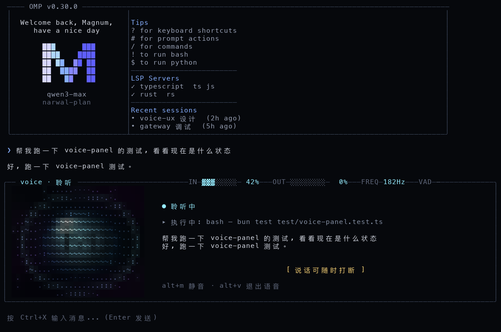
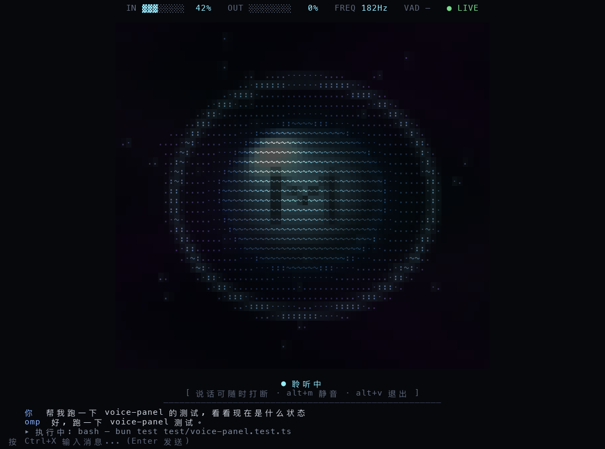

# Voice 交互 UX 重设计 · Orb 方案

> 状态：待拍板 · 2026-08-06 · 分支 feature/voice-ux
> 参考原型：`voice_tui/`（render_frames.py + voice_player.py，预览见 voice_preview_full.gif）

## 0. 现状与问题

现有 `VoicePanel`（docs/voice-jarvis-p0-design.md §4 落地）：文本行式面板，7 个 LivePhase，
level bar（▁-█）/ 波形（⌇/）/ braille spinner / 转写窗口（3 条 10 行）/ 按键提示。
差分渲染 + signature 帧门控已就位（空闲零重绘）。

对照原型，当前 UX 的差距：

1. **状态辨识弱**——状态靠文字徽章区分，语音交互时用户不会盯着读字。
2. **没有主体**——信息行堆叠，缺一个承载 agent 存在的视觉锚点。
3. **反馈不连续**——10 格 level bar 与真实音量耦合弱，"它在听我"的感知不足。
4. **色彩无语义**——没有 输入=蓝 / 处理输出=橙 的一致映射。
5. interrupted / muted / error 只有一行文字，视觉无冲击差异。

## 1. 目标 / 非目标

**目标**

- 把原型的视觉语言落进生产 VoicePanel：一个 orb、四种呼吸，状态只靠颜色语义 + 运动参数表达。
- 蓝 = 输入侧（connecting/listening），橙 = 处理输出侧（thinking/speaking）。
- **真实数据驱动动效**：mic RMS → 呼吸幅度与脉冲环；speaker RMS → 波形环幅度。不是罐头循环。
- 保留全部现有信息面：转写卡拉 OK、工具执行行、打断提示、按键提示。

**非目标**

- 不动状态机（LivePhase）、transport、voice-gate、task-router——只改渲染层与布局。
- 不做全屏沉浸模式：原型的星云背景 + VOICE.SYS HUD 是演示形态，生产面板仍嵌在 editor 上方。

## 2. 状态映射（7 phases → orb 行为）

| LivePhase | 颜色 | orb 行为 | 数据驱动 |
|---|---|---|---|
| connecting | 蓝（暗） | 呼吸（慢） | — |
| listening | 蓝 | **呼吸**（唯一签名动效，持续播放） | — |
| thinking | 蓝 | 呼吸 | — |
| speaking | 蓝（亮） | 呼吸 | — |
| interrupted | 蓝（亮） | 静止 | — |
| muted | 蓝灰去饱和 | 静止 | — |
| error | 蓝（暗） | 静止 | — |

**动效决策（2026-08-06 定稿）**：单色球（蓝，不再蓝橙切换）；唯一签名动效 = 呼吸，
静音时持续循环播放，不随声音音量变化（用户定稿）。备选方案对比见 `voice-ux/animation/`
（A_breath 呼吸 / B_ring 脉冲环 / C_wave 波形环 / D_swirl 内部漩涡 / E_combo 组合，已选 A）。
状态切换无视觉过渡（用户定稿：只留呼吸，不加任何额外动效）。脉冲环/漩涡/波形环代码保留为
`effects` 显式覆盖选项，默认不启用；尘埃已删除。

隐藏 M 水印保留（随半径呼吸，M_SPAN=0.8 / M_STRENGTH=0.55，原型已迭代定稿）。

## 3. 布局（两种形态，mock 已定稿）

### 布局 A · 面板模式（P1）

欢迎页保留，语音面板嵌在输入框上方；标题与实时参数条同行，嵌在面板顶部边框：



```
╭─ voice · 聆听 ── IN ▓▓▓░░░░░ 42%  OUT ░░░░░░░░ 0%  FREQ 182Hz  VAD —  ● LIVE ─╮
│ [orb 30×14] │ 字幕窗口 / 执行行 / 打断提示                                      │
╰────────────────────────────────────────────────────────────────────────────╯
```

- 面板 16 行（标题行 + 14 内容行 + 底边框），宽度随终端。
- 窄终端（<80 列）：回落现有纵向堆叠，orb 缩为顶部小尺寸。

### 布局 B · 沉浸模式（P2）

进入 voice 后切到专属视图：无欢迎页，70×35 大球 1:1 全质量居中，消息记录固定在底部
（最近 N 轮），参数条屏幕顶部居中：



- 退出 voice 回到常规视图需要过渡；文本输入保持可用。
- 窄终端 / 低性能自动回落布局 A。

### 对比

| 维度 | A 面板模式 | B 沉浸模式 |
|---|---|---|
| 光球存在感 | 30×14，配角 | 70×35 居中，主角 |
| 上下文连续性 | 完整（欢迎页/全部历史） | 断裂（仅最近 N 轮） |
| 状态感知 | 中 | 最强 |
| 实现成本 | 低（替换面板渲染层） | 中（视图切换机制） |

### 实时参数条（HUD）

参考原型 VOICE.SYS HUD；布局 A 嵌顶部边框（标题同行），布局 B 屏幕顶部居中。

| 参数 | 来源 | 成本 |
|---|---|---|
| IN / OUT | `onLevels(input, output)` 已实时推送 mic/speaker RMS | 零成本（P1） |
| FREQ | mic PCM 块零交叉音高估计 | controller ~20 行（P2） |
| VAD | 本地 RMS 静音计时，仅 `voiceActivityDetection` 开启时显示 | 小（P2） |
| ● LIVE | 通道状态：绿=正常 / 黄=重连 / 红=异常 | 零成本（P1） |

颜色随状态走：聆听=蓝、播报=橙，与光球语义一致。

### 任务执行场景（布局 B，已定稿）

thinking 分两段，长任务时光球让位给活动流：

1. **意图理解**（~1s）：大球转橙 + 内部光轨，球下「⣾ 思考中」。布局不变。
2. **任务执行中**（长时段）：光球缩小为 24×12 小球挂顶居中（橙色漩涡动效），
   球下「⣾ 执行任务中 · Ns」计时；小球腾出的中央 ~18 行成为**活动流**：
   - 任务标题行
   - 工具调用列表：✓ 完成 / ✗ 失败 / ▸ 进行中 + 工具名 + 参数 + 耗时
   - 最新工具输出片段（`│` 前缀，dim，只显示最新 2-3 行，不刷屏）
   - 进度汇总行（N 个工具调用 · x 完成 y 失败 z 进行中 · 已用 Ns）
   - 活动流可滚动，保留最近 N 条
3. **结果播报**：任务完成转 speaking，球恢复大球播报结果，转写进底部消息区；
   完整文本输出仍写入主 session，退出语音模式可见全文。

尺寸预算（46 行视口）：HUD 1 + 小球区 13 + 活动流 18 + 消息记录 4 + 提示/输入 2。
任务执行中 mic 保持热态，提示行暴露语音控制：说"进度"查状态、说"取消"停任务
（复用现有 `omp_agent_control` 的 status/steer/cancel）。

## 4. 渲染方案（tradeoff）

**A. 烘焙翻书（原型原样）**——预渲染 360 帧 ANSI 随包发布。
- 优点：观感与原型 100% 一致。
- 缺点：31MB 资产；固定 100×40，小终端只能 crop；**致命**：罐头循环无法被真实
  mic/speaker RMS 驱动，丢掉本次重设计最大的 UX 价值。

**B. 实时程序化渲染（推荐）**——把原型数学移植成 TS，只渲染 orb 区域。
- 性能估算 [inference]：orb 区 ~60×18 cells，2x 超采样 ≈ 4.3k 像素/帧；
  球体着色 + 预计算 bloom 衰减表，M1 上 <2ms/帧，20fps 可行。
- 优点：任意终端尺寸、真实数据驱动、接 theme、零资产。
- 缺点：观感较原型简化（星云背景、远景尘埃裁掉或简化）。
- render_frames.py 保留为 dev-only 离线工具，产 golden frames 做视觉回归。

**C. 保守**——保留文本面板只改配色。不解决状态辨识问题，否决。

结论：B。

## 5. 交互增强（视觉之外）

1. **barge-in 预显**：speaking 中 mic RMS 超阈值 → orb 边缘先亮蓝色弧（~100ms），
   再真正打断。让"可以打断"变成可感知的反馈而不是提示文字。
2. **VAD 倒计时**：`voiceActivityDetection` 开启时，静音尾段显示脉冲环收缩 +
   剩余秒数（现状自动停录无任何视觉，用户不知道何时停）。
3. **mute 常驻标记**：去饱和 + 斜杠，替代纯文字。
4. （P2，本次不做）确认门可视化：voice-gate 黄/红工具确认时 orb 转环 + 确认提示。

## 6. 降级与性能护栏

- `NO_COLOR` / `TERM=dumb` → 现有纯文本面板（plain 路径保留）。
- 面板宽度 <60 → 纯文本模式。
- 256 色终端 → 颜色映射降级（P3）。
- 帧率自适应：20fps → 12fps（CPU 压力/转写高速流）→ 静态。
- 保留 signature 门控 + 差分渲染；静态相位（error/muted）零重绘。

## 7. 变更范围

| 文件 | 动作 |
|---|---|
| `src/modes/components/voice-orb.ts` | 新增：orb 程序化渲染器（phase + levels → ANSI cells） |
| `src/modes/components/voice-panel.ts` | 改造：水平布局、集成 orb、保留转写/状态逻辑 |
| `test/voice-panel.test.ts` | 更新 + 新增 golden-frame 回归 |
| `voice_tui/render_frames.py` | 保留为 dev 工具（golden frames），不进发布产物 |
| `src/live/*`、`voice-mode-controller.ts` | **P1 不动**（VoicePanelState 已含 inputLevel/outputLevel）；P2 加 FREQ/VAD 采集 |
| `src/modes/interactive-mode.ts` | P2：沉浸视图 ↔ 常规视图切换（布局 B） |

## 8. 验收

1. 7 状态按映射表呈现，蓝/橙语义正确（人工对照原型 gif）。
2. mic 音量可见地改变 orb 呼吸幅度（实测）。
3. 渲染 <3ms/帧 @20fps（M1）；空闲零重绘（signature 门控测试）。
4. NO_COLOR / 窄终端正确回落文本面板。
5. 现有 voice-panel 测试全绿；alt+v / alt+m / esc 行为不变。

## 9. 分期

- **P1**：orb 渲染器 + 布局 A + 状态映射 + HUD（IN/OUT/LIVE，数据现成）。
- **P2**：布局 B 沉浸视图 + FREQ/VAD 参数 + barge-in 预显 + VAD 倒计时。
- **P3**：256 色降级、golden-frame 视觉回归。
