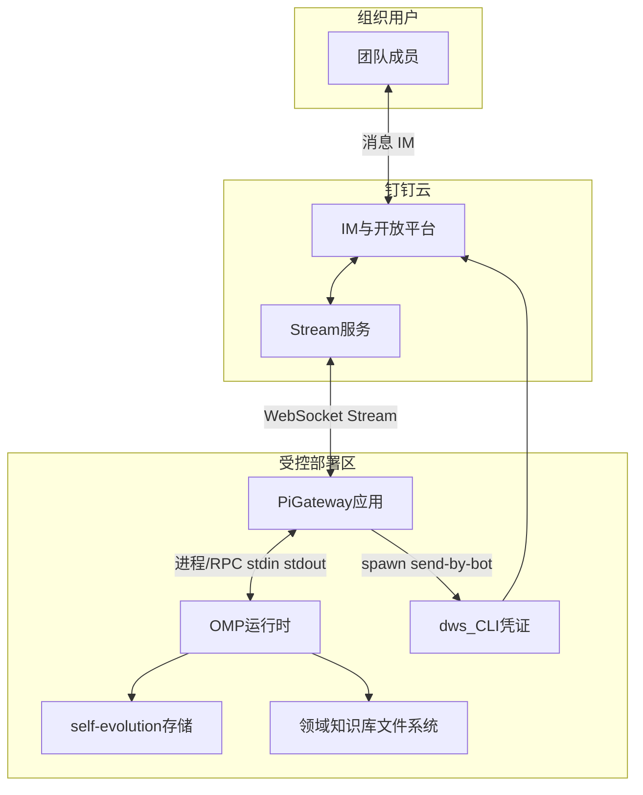
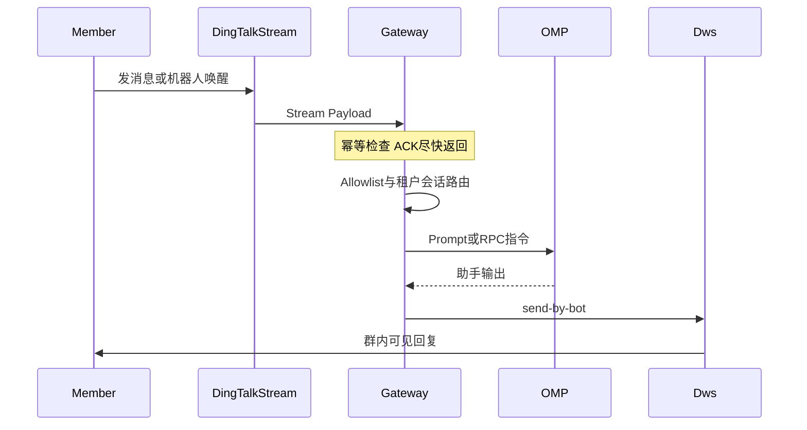

# 钉钉+OMP agent team 设计方案 V1.1

| 项 | 说明 |
|---|------|
| 文档版本 | V1.1 |
| 文档类型 | 系统架构 / 方案设计（Solution Design） |
| 适用仓库 | `oh-my-pi`，核心落地包 `packages/pi-gateway`、`packages/coding-agent`、`packages/self-evolution` |
| 状态 | 设计基线 |
| V1.1 修订摘要 | 增补 **Workspace Root** 交互范式、`omp agent setup` 脚手架约定、**仅存 workspace**（ADR-4）；附录 **D — 命令行与配置模板** |

---

## 1. 背景与问题域

### 1.1 业务动因

组织希望在 **钉钉** 内以「多名领域专员」的形式使用 **OMP（Oh My Pi 编码助手）**：每个专员对应一块 **业务领域**，承担 **理解、监管、在该领域内完成功能构建** 的职责；随使用沉淀 **领域记忆与自我进化**，并保留 **可追溯的进化版本**。团队成员通过钉钉与专员 **一对多** 并发交互，而各专员之间 **能力与数据隔离**。

### 1.2 技术问题陈述

需在 **企业 IM（钉钉）**、**本地/内网 OMP 运行时**、**钉钉开放能力（dws CLI）** 之间建立 **稳定、可隔离、可审计** 的桥接层：上行实时可达、下行身份可信、执行环境与存储 **按领域租户化**，并为常驻运行时预留演进空间。

### 1.3 首要交互范式（Workspace Root）

目标用户路径约定如下（与实现分期无关，**契约先行**）：

1. 用户在任意位置 **新建空文件夹**，作为 **Agent Workspace Root**。
2. 在该文件夹内执行 **`omp agent setup`**（规划中 CLI）：生成约定目录结构、`gateway.json` 示例、`profile.yaml`、`mission.md` 占位等。
3. 用户在本机启动 **`pi-gateway`**，指向该目录下的 `gateway.json`，并与钉钉机器人对话；**与该 Agent 相关的网关持久化数据与 OMP 会话数据均落在该 Workspace Root 的子路径内**（见 ADR-4），便于备份、迁移与版本控制。

---

## 2. 目标与非目标

### 2.1 目标（需在设计层面可满足）

| ID | 目标 | 可验收表征 |
|----|------|------------|
| G1 | 每钉钉机器人绑定唯一「领域 Agent」执行上下文 | 独立 cwd、凭证、`robotCode`、可选独立网关实例 |
| G2 | 领域画像配置化 | 单文件声明身份、领域、知识库、技能、钉钉与 OMP 绑定 |
| G3 | 域级记忆与进化隔离 | 每领域独立 `evolution.dataDir`，不与其它领域共用 OLTP SQLite |
| G4 | 钉钉一对多 | 路由键区分会话维度；allowlist 控制可调参与者集合 |
| G5 | 运行时演进能力 | 自 **`omp -p` 按需进程** 过渡至 **`omp --mode rpc` 常驻** 而不失配置同一套画像 |
| G6 | Workspace 自包含 | Workspace Root 内含网关 `dataDir`、OMP agent 根目录与 evolution 路径（本条链路不静默写全局 `~/.pi`/`~/.omp`） |

### 2.2 非目标（本期不包含）

- 跨 Agent **自动编排**（队长调度、任务移交 DAG）。
- 钉钉以外的通道（飞书、企微）的统一适配（预留网关抽象即可）。
- 代替 OMP 内置模型计费与安全审计全流程（仅定义网关侧重试与配额钩子）。

---

## 3. 术语与边界对象

| 术语 | 定义 |
|------|------|
| **Workspace Root** | 用户创建并经 `omp agent setup` 初始化的目录；钉钉与该 Agent 的对话产物归属边界 |
| **领域 Agent** | 与单个钉钉 bot、`businessDomain`、一份画像配置绑定的逻辑实例 |
| **领域画像（Profile）** | 描述该 Agent 身份、能力边界、集成凭证与运行时策略的配置工件 |
| **路由租户键** | `botId`（或等价 profile id）；会话隔离键 `(botId, conversationId[, userId])` |
| **域级进化存储** | 绑定 `packages/self-evolution` 数据模型的 SQLite（及其它工件），**每 domain 一份物理目录** |
| **dws** | 钉钉工作台 CLI；出站发消息走 **`dws chat message send-by-bot`**，复用终端侧 OAuth |

---

## 4. 系统上下文（C4 Level 1）



**外部依赖**：钉钉开放平台应用凭证；钉钉账号已通过 dws 登录的本机环境；模型/API 密钥按 OMP 既有约定注入。

---

## 5. 逻辑架构（容器与职责）

### 5.1 容器视图（C4 Level 2）

| 容器 | 职责 | 技术映射 |
|------|------|----------|
| **接入网关** | Stream 生命周期、事件幂等与 ACK 策略、入站解析、`OutboundMessage` 派发前的路由与安全校验 | `packages/pi-gateway`（`gateway.ts`、`channels/dingtalk.ts`） |
| **Agent 运行时桥接** | 将规范化消息转为 OMP 调用；维护 **print** 或 **rpc** 两种后端形态与会话队列 | `agent-bridge.ts` 及规划中的 RPC 池扩展 |
| **OMP** | LLM、工具、会话持久化（jsonl 等）、与画像一致的 cwd/env | `omp` / `packages/coding-agent` |
| **出站连接器（dws）** | 以机器人身份向钉钉会话投递 Markdown/文本 | `dws` 子进程，网关编排调用参数 |
| **配置与画像仓库** | 声明领域与安全边界；**密钥不落版本库** | **首选**：Workspace Root 内 `profile.yaml`、`gateway.json`、`mission.md`；全局 `~/.pi` 仅作未采用 Workspace 模式时的可选fallback（不在本文 ADR-4 链路内默认启用） |

### 5.2 组件交互要点

- **职责分离**：网关 **不写钉钉 OAuth token**；出站一律委托 **dws**（避免网关维护开放平台令牌轮换）。
- **领域绑定**：每条 Stream 连接对应 **单一开放平台应用**；出站 **`robotCode`** 与该应用机器人一致。
- **状态分层**：**对话周转状态**（钉钉会话线程）与 **域级慢变量**（evolution）分层存储，避免会话 sqlite 与 evolution sqlite 混为一谈。

---

## 6. 核心场景与时序

### 6.1 典型交互序列



### 6.2 架构约束（时序相关）

- **ACK 与耗时解耦**：网关应在开放平台允许的时限内完成 **协议层应答**；LLM 与工具执行置于 **异步路径**，通过 **二次推送（dws）** 交付结果，降低超时重试与重复执行风险。
- **幂等**：以钉钉消息唯一标识去重，防止 Stream 重放导致重复工具副作用。

---

## 7. 数据架构

### 7.1 逻辑数据分层

| 层级 | 内容 | 一致性 / 隔离 |
|------|------|----------------|
| **L1 会话周转** | 网关 Session Store（SQLite）、钉钉 `conversationId` → OMP 对话线程标识 | `gateway.json` 中 **`dataDir` 必须位于 Workspace Root 子路径**（ADR-4）；键前缀含 **`botId`** |
| **L2 OMP 会话工件** | jsonl、resume 路径、`sessionDir` | **`PI_CODING_AGENT_DIR`（或等价）指向 Workspace 下目录**；由 setup 脚手架与 spawn env 强制 |
| **L3 域级进化与约定** | `packages/self-evolution` SQLite + 附属工件 | **物理目录每 domain 独立**，且位于 Workspace 内（如 `./evolution/`）；禁止多 Agent 共文件 |
| **L4 静态知识库** | Markdown / 文档树根路径 | 只读优先；RAG 检索须 **域过滤** |

### 7.2 配置数据（画像）

画像为 **声明式契约**：标识与使命（引用静态 `.md`）、`businessDomain`、知识库与技能、`dingtalk.*`、`omp.*`、`runtime.*`、`memory.*`、`evolution.*`。运行时 **仅解析与校验**，不在网关内拼接长提示词文本（遵守仓库「提示词静态文件化」规范）。

**每个 Agent 应具备 prompt 类静态文件**（如 `mission.md`），由 OMP `--append-system-prompt` 或等价机制引用；不设长提示词的内联拼接。

**命令行与目录模板**见 **附录 D**。

---

## 8. 集成架构

### 8.1 钉钉 Stream（入站）

- **协议源**：以钉钉开放平台 Stream 规范为准；现有 `packages/pi-gateway/src/channels/dingtalk.ts` 为占位实现，**必须对标官方 SDK 或文档**后投产。
- **容量**：多 bot 若对应多开放平台应用，连接与配额 **按应用维度** 规划。

### 8.2 dws（出站）

- **契约**：`dws chat message send-by-bot --robot-code … --group|--users … --format json`。
- **失败策略**：记录结构化错误；避免失败回复路径上的 **无限递归发送**。

### 8.3 OMP（执行）

- **MVP**：子进程 `omp -p`。
- **目标态**：子进程 `omp --mode rpc`，网关维持 JSON 协议会话（参考 `packages/coding-agent/src/modes/rpc/rpc-mode.ts`）。

---

## 9. 部署架构

### 9.1 推荐演进路径

| 阶段 | 拓扑 | 取舍 |
|------|------|------|
| **Alpha** | **每 bot 一进程** `pi-gateway` + **Workspace 内一份 `gateway.json`** | 故障域最小；`cwd` 建议设为 Workspace Root |
| **Beta** | 可选合并为 **单进程多 bot**：registry 多实例 + session **`botId` 命名空间** | 运维集中、代码复杂度上升 |

### 9.2 依赖拓扑

长驻主机需：**Bun**、可执行 **`omp`**、已登录 **`dws`**、出站可访问钉钉 API、入站 Stream **出网可达钉钉 WebSocket**。

---

## 10. 安全架构

| 域 | 措施 |
|----|------|
| **身份与授权** | `allowedUsers` / `allowedGroups` **默认强制**；未命中则丢弃或固定拒绝话术 |
| **执行边界** | `cwd` + `toolsAllowlist`（画像可选）；最小权限 OS 用户（运维加固） |
| **密钥** | `appSecret`、`robotCode`、模型密钥仅存 Workspace 内私密文件或环境变量；**禁止提交 git** |
| **多租户隔离** | 路由键与文件路径强制 **`botId`/`businessDomain` 前缀**；evolution **单实例单库** |

---

## 11. 可靠性、可观测性与运维

| 维度 | 要求 |
|------|------|
| **进程监管** | RPC 子进程存活探测、崩溃指数退避重启、最大重启次数告警 |
| **背压** | 每 `(botId, conversationId)` 消息队列深度上限；全局 OMP 并发上限 |
| **可观测性** | 结构化日志：tenant 键、traceId（钉钉消息 id）、阶段耗时、omp exitCode |
| **备份** | **打包整个 Workspace Root** 即备份会话与进化（evolution）；升级 OMP/self-evolution 前冻结写入快照 |

---

## 12. 风险登记与架构决策摘要

| 风险 | 缓解 |
|------|------|
| Stream 协议漂移 | 官方 SDK 优先；契约测试 / fixture |
| ACK 超时导致重复执行 | 幂等 + 异步下发结果 |
| SQLite 写竞争（进化） | 委托 self-evolution 既有并发语义；必要时域内串行写队列 |
| 常驻 OMP 资源泄漏 | TTL、会话驱逐、进程级回收 |

**ADR-1**：出站 **统一 dws**，网关不持有开放平台业务 token。  
**ADR-2**：域级进化存储 **物理隔离目录**，不与会话 Store 混库。  
**ADR-3**：首期 **不做跨 Agent 编排**，人类通过 **@ 不同机器人** 完成协作。  
**ADR-4（仅存 Workspace）**：与本钉钉 Agent 链路绑定的 **`gateway.json` → `dataDir`**、**OMP 使用的 agent 数据根（如 `PI_CODING_AGENT_DIR`）**、**`evolution.dataDir`** **必须全部落在 Workspace Root 的子路径内**；本条链路 **默认不静默写入** 全局 `~/.pi/gateway-data` 或 `~/.omp/agent`。若运维显式覆盖环境变量，须在运维文档中单独标注为例外。

---

## 13. 附录 A — 路由键规范（契约）

- **租户**：`botId` ≡ 画像 `id`（或与开放平台应用稳定映射）
- **会话线程**：`conversationId`（钉钉 OpenConversationId，联调确认字段对齐）
- **可选增强**：`userId`（staffId）用于同会话内细粒度审计或二次隔离

---

## 14. 附录 B — 外部设计参照（非规范性）

- 钉钉 Stream：**快速 ACK**、**订阅最小集**、**连接与用量上限**、官方接入链路。
- 多租户 Agent：**租户→用户→会话** 三层模型；**配额先于 LLM**；RAG **强制租户过滤**。

---

## 15. 附录 C — 实施任务清单（工程跟踪）

1. **画像与绑定**：领域画像 schema（YAML/JSON5）+ 校验 + 与 `botId` 绑定；合并 dingtalk 凭证、`robotCode`、`dwsBinary`、`runtime`、`cwd`、`evolution.dataDir`。
2. **`omp agent setup`**：`packages/coding-agent`（或 `omp` 入口）新增子命令，在 cwd 生成 Workspace 布局与示例配置（见附录 D）。
3. **Stream 与 dws**：Stream 入站对齐官方协议/SDK；出站 spawn `dws send-by-bot`（JSON、分片）；`OutboundMessage` 携带 `robotCode`、群/用户路由。
4. **Allowlist 与路由**：gateway 落实 `allowedUsers`/`allowedGroups`；按 `conversationId`（及可选 `userId`）路由 OMP/RPC 会话，禁止跨会话串台。
5. **ADR-4 强制**：spawn OMP / 加载 `gateway.json` 时校验路径落在 Workspace Root 内（或由 setup 仅生成相对路径消除歧义）。
6. **多 bot 部署**：先采用「多进程 pi-gateway + 单 Workspace `gateway.json`」；文档化后再评估单进程 `bots[]` + `botId` 前缀 session store。
7. **运行时 RPC**：`omp --mode rpc` 常驻池 + 崩溃拉起 + 每会话并发队列/超时；`runtime.mode` 下 `print` 与 `rpc` 并存供 MVP。
8. **Evolution 隔离**：每领域独立 `evolution.dataDir`；对接 `packages/self-evolution`；版本/快照策略写画像；禁止多 agent 共 SQLite。
9. **验证与文档**：dws spawn 单测、Stream fixture、`packages/pi-gateway` README（依赖、安全、勿提交密钥）。

---

## 16. 附录 D — 命令行与 Agent 配置模板

### D.1 Workspace 目录结构（`omp agent setup` 目标布局）

**约定**：下列路径均相对于 **Workspace Root**（用户创建的空文件夹）。

```
WorkspaceRoot/
  README.agent.md           # 启动说明：pi-gateway、dws、钉钉凭证填法（脚手架生成）
  gateway.json              # pi-gateway 配置（可用 JSON5 注释；见 D.3）
  profile.yaml              # 领域画像（规划契约；网关加载待实现）
  mission.md                # 领域系统提示附录（OMP append-system-prompt 引用）

  .pi-gateway/              # gateway.json 中 dataDir 指向此处（会话 SQLite、sessions/）
  .omp-agent/               # PI_CODING_AGENT_DIR 指向此处（config、sessions、memories 等）
  evolution/                # evolution.dataDir（self-evolution SQLite）
  knowledge/                # 可选：静态领域文档根
```

**约束**：`.pi-gateway/` 与 `.omp-agent/`、`evolution/` **不得互相共用同一 SQLite 文件**。

### D.2 初始化指令（已实现 vs MOCK）

**已在仓库存在的命令**（`packages/pi-gateway/src/cli.ts`）：

```bash
# 校验配置文件解析（将 gateway.json 填入占位值后）
bun packages/pi-gateway/src/cli.ts config --config ./gateway.json

# 前台启动网关（开发）
bun packages/pi-gateway/src/cli.ts start --config ./gateway.json
```

**规划中（MOCK — 当前 CLI 未实现）**：

```bash
# 在空 Workspace Root 内执行；生成 D.1 所列骨架与占位文件
omp agent setup

# 可选：校验画像 schema（实现后对 profile.yaml 做校验）
omp agent validate profile.yaml
```

### D.3 `gateway.json` 模板（与当前 `pi-gateway` schema 对齐）

以下为 **JSON5** 示意；字段以 [`packages/pi-gateway/src/config.ts`](packages/pi-gateway/src/config.ts) 为准。**`dataDir` 使用 Workspace 相对路径以满足 ADR-4**。

```json5
{
  // 网关会话数据 — 必须位于 Workspace Root 下（ADR-4）
  dataDir: "./.pi-gateway",

  channels: {
    dingtalk: {
      enabled: true,
      appKey: "REPLACE_APP_KEY",
      appSecret: "REPLACE_APP_SECRET",
      robotCode: "REPLACE_ROBOT_CODE", // 出站 dws send-by-bot 使用；可与 dws chat bot search 对照
      allowedUsers: [], // 可选：钉钉 staffId 白名单；为空则需在实现中定义默认拒绝策略
      allowedGroups: [], // 可选：会话/群维度白名单
    },
  },

  agent: {
    ompPath: "omp",
    model: "REPLACE_MODEL_OPTIONAL",
    maxConcurrentSessions: 3,
  },

  session: {
    idleTimeoutMinutes: 60,
    resetPolicy: "idle",
  },
}
```

### D.4 `profile.yaml` 模板（规划契约）

网关自动加载 **尚未实现**；与 OMP spawn 合并时需与代码对齐。示例：

```yaml
id: example-domain
displayName: Example Domain Agent
businessDomain: EXAMPLE

missionFile: ./mission.md

knowledgeBase:
  paths:
    - ./knowledge

dingtalk:
  appKey: REPLACE_APP_KEY
  appSecret: REPLACE_APP_SECRET
  robotCode: REPLACE_ROBOT_CODE
  allowedUsers: []
  allowedGroups: []

omp:
  cwd: .                     # Workspace Root
  ompPath: omp
  appendSystemPromptFile: ./mission.md

runtime:
  mode: print                 # print | rpc（规划）

memory:
  codingAgentDir: ./.omp-agent

evolution:
  dataDir: ./evolution
```

### D.5 `pi-gateway` CLI 速查

| 命令 | 说明 |
|------|------|
| `pi-gateway start [--config <path>]` | 前台启动 |
| `pi-gateway status [--config <path>]` | 状态 |
| `pi-gateway config [--config <path>]` | 打印解析后配置 |
| `pi-gateway service install \| …` | 安装为系统服务（可选） |

默认配置路径（未传 `--config`）：`~/.pi/gateway.json`。Workspace 模式下 **应始终传入** `./gateway.json`。

### D.6 `dws` 备忘

参数以本机 `dws ... --help` / `dws schema ...` 为准。典型运维：

```bash
dws chat bot search --format json
# dws chat message send-by-bot --robot-code … --group … --text … --format json
```

---

**代码变更主战场**：`packages/pi-gateway`、`packages/coding-agent`（`omp agent setup`）。
